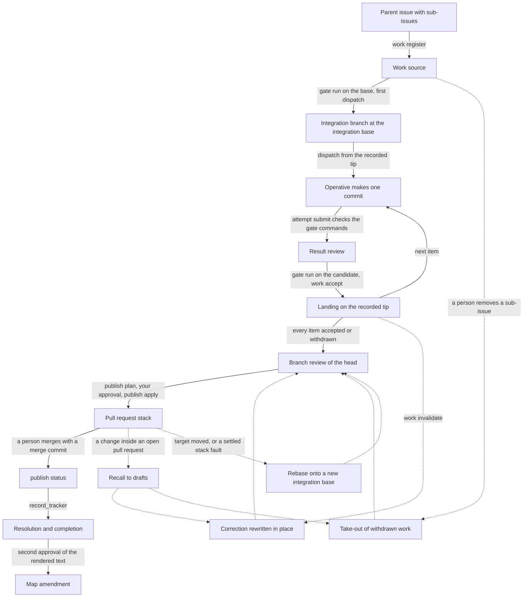

# Operator

Personal skills and CLI tools for coordinating coding agents in OpenCode and Claude Code through [Herdr](https://herdr.dev/).


> [!NOTE]
> Inspired by The Matrix, an Operator loads programs, guides missions, and keeps the crew in the field connected.

Operator is based on [Matt Pocock's agent skills and workflow](https://github.com/mattpocock/skills).
His skills guide the work from clarifying a goal and writing a spec through tickets, implementation, and review.
Operator builds on that workflow by coordinating the agents, worktrees, and recorded decisions that carry the work between those steps.

## Status

Every step of the first orchestration workflow works end to end: project setup, release selection and updates, readiness, the live probe, crew state, dispatch, questions, review, rework, tracker completion, cleanup, and the coordination loop.
The integrated pull request workflow also works end to end: one work source becomes one reviewed pull request stack that a person merges.
The repository also holds the release build, the Operator-owned JSR client, the Changesets and GitHub Actions workflows, and smoke tests of both delivery paths.

The release workflow publishes a version to JSR and GitHub after its version pull request merges.

## How it works

1. You work with the Operator to clarify a goal and choose the work to delegate.
   You, or a planning skill such as `to-tickets`, write it as a parent issue with one sub-issue for each ticket. Operator never creates an issue.
2. The Operator registers the parent issue as a work source, and assigns each item to a crew member, called an Operative. Each Operative runs in its own Git worktree that Herdr manages.
3. Operatives use Matt Pocock's skills such as `implement`, `research`, `improve-codebase-architecture`, and `grilling` to do their work. A code result is one commit.
4. An Operative that cannot continue asks the Operator. The Operator answers from recorded decisions, and brings the questions that need your judgment to you.
5. A separate reviewer uses Matt's `code-review` skill to check each result on the Standards and Spec axes before the Operator presents it for acceptance.
6. At acceptance, the CLI lands the reviewed commit on the integration branch of the source, after that commit passed the project gate.
7. When every item is accepted, one branch review reads the whole branch. The CLI then publishes it as an integrated pull request behind your approval.
8. You, or a teammate, merge the pull request on GitHub. The Operator and the crew never merge. After the merge, the CLI completes the tickets.
9. After each handoff, the CLI closes the crew agent and removes its worktree behind your approval. A worktree that holds work that did not land stays until you remove it.

Talk to the Operator. An Operative never addresses you directly, and it raises each question through the Operator.

Herdr supplies the terminal and agent control.
Operator adds the coordination rules, the skills, and the CLI operations that Herdr does not have.

## Requirements

| Tool | Why |
| --- | --- |
| [Bun](https://bun.com) 1.4.0 or later | Runs the CLI. The CLI refuses an earlier Bun. |
| Git | Holds the project and each Operative worktree. |
| [Herdr](https://herdr.dev/) | Creates worktrees, launches agents, and reads their panes. |
| GitHub CLI (`gh`) | Reads and writes the tracker. GitHub is the only tracker this release supports. |
| Claude Code, OpenCode, or both | The agent hosts for the Operator and the crew. |

Optional: [`jq`](https://jqlang.github.io/jq/) lets agents select fields from the CLI's `--json` output without reading the full result.
Operator does not require `jq` to run.

## Quick start

1. From your Git project root, add the exact published JSR release as a devDependency:

   ```sh
   bunx --bun jsr add --bun --save-dev "@fveracoechea/operator@<version>"
   ```

   Add this script to the project's `package.json`:

   ```json
   { "scripts": { "operator": "bun node_modules/@fveracoechea/operator/cli.js" } }
   ```

   JSR's generated package manifest has no `operator` binary.
   The project script runs the CLI entry point from its installed devDependency.

   Run the installed CLI from the project root:

   ```sh
   bun run operator --version --json
   bun run operator install --opencode
   ```

   Use `--claude` instead for Claude Code, or pass both flags if you use both hosts.

2. Open the project in Herdr and start an agent on that host.
   For OpenCode, ask:

   > Load the operator skill. Set up Operator for this repository with OpenCode as the Operator and crew host. Select an exact published JSR release. Show me each plan before you apply it.

   The agent will guide you through project setup, installing the other project skills, selecting a release, and checking readiness.
   Select the commit and package version of the installed release with `bun run operator update`.
   Commit `package.json`, `.npmrc`, and `bun.lock` so new worktrees can run `bun install --frozen-lockfile` before they use the CLI.
   A live probe launches agents and needs its own approval.
   Commit the installed project skills before starting crew work so Operative worktrees can load them.

3. Give the Operator a task in the same project:

   > Load the operator skill. I want to add a search field to the issues list. Help me agree on what it should search. When I have created the parent issue and its sub-issues, register it and coordinate the crew through implementation, review, and the integrated pull request.

   Replace the search field with your own goal.
   You can return later and ask the Operator to resume the crew.

For the commands behind these steps, see [Project installation and setup](#project-installation-and-setup), [Project readiness](#project-readiness), [The integrated pull request workflow](#the-integrated-pull-request-workflow), and [Coordination and recovery](#coordination-and-recovery).

## Contents

- [The integrated pull request workflow](#the-integrated-pull-request-workflow)
- [The state machines](#the-state-machines)
- [CLI conventions](#cli-conventions)
- [Project installation and setup](#project-installation-and-setup)
- [Release and updates](#release-and-updates)
- [Project readiness](#project-readiness)
- [The live probe](#the-live-probe)
- [Crew state and the frontier](#crew-state-and-the-frontier)
- [Operative dispatch and recovery](#operative-dispatch-and-recovery)
- [Questions, answers, and approvals](#questions-answers-and-approvals)
- [Reviewed results and acceptance](#reviewed-results-and-acceptance)
- [Rework, limits, and invalidated results](#rework-limits-and-invalidated-results)
- [Tracker completion and recovery](#tracker-completion-and-recovery)
- [Cleanup](#cleanup)
- [Coordination and recovery](#coordination-and-recovery)
- [Development](#development)

## The integrated pull request workflow

Operator runs one approved work source to one reviewed integrated pull request.
The pull request holds one commit for each accepted code result, in dependency order, and each commit passed the project gate on its own.

The [rules of the person](skills/operator/SKILL.md#the-rules-of-the-person) apply to every step, and they come before a topic, an ADR, and a command report:

- R1. The Operator is read-only. It asks the crew or an Operative to make each change, and it writes no content of its own.
- R2. Nothing merges a pull request without your explicit approval.
- R3. Nothing tears down unlanded work.
- R4. An Operative never addresses you directly.
- R5. The Operator keeps its own context low. A command that it reads gives a summary and points to the details.



A full run of one source, in the order `crew next` offers the commands:

```sh
# Ask what to do next. Run it on every turn that touches the crew.
bun run operator crew next --claude --json

# Read the parent issue and change nothing, then register the plan revision it names.
bun run operator work register --plan --input work.json --json
bun run operator work register --request <id> --owner-token <token> --input work.json --plan-revision <revision> --json

# Gate the integration base, then dispatch the first code item from it. This creates the integration branch.
bun run operator work claim --request <id> --owner-token <token> --assignment <id> --revision <n> --json
bun run operator gate run --request <id> --owner-token <token> --source <source> --commit <base> --json
bun run operator attempt dispatch --request <id> --owner-token <token> --attempt <id> --commit <base> --json

# The Operative submits one commit, and a reviewer reports. Dispose of each finding.
bun run operator review dispose --request <id> --owner-token <token> --review <id> --input dispositions.json --json

# Gate the planned commit of the landing, then accept. The acceptance lands the commit.
bun run operator gate run --request <id> --owner-token <token> --assignment <id> --json
bun run operator work accept --request <id> --owner-token <token> --assignment <id> --revision <n> --attempt <id> --submission <id> --json

# Each later item dispatches from the recorded tip, with no --commit.
# The last acceptance registers the branch review. Claim it, dispatch it with no --commit, and dispose of its findings.

# Preview the publication, record your approval, and publish.
bun run operator publish plan --source <source> --json
bun run operator approval grant --request <id> --owner-token <token> --input approval.json --json
bun run operator publish apply --request <id> --owner-token <token> --source <source> --plan-revision <revision> --json

# A person merges each pull request on GitHub. Then read what GitHub shows, and complete the tickets.
bun run operator publish status --request <id> --owner-token <token> --source <source> --json
bun run operator publish retarget --request <id> --owner-token <token> --source <source> --part <k> --json
bun run operator tracker record --request <id> --owner-token <token> --assignment <id> --revision <n> --input step.json --json
```

The Operator runs each command that `crew next` names.
The [operator skill](skills/operator/SKILL.md) tells it which topic to read for each action.

### A work source from a parent issue

A work source is a parent issue with its sub-issues, or one ticket.
The CLI reads the items, their order, their blocking links, and the text of each one from GitHub.
Your input holds only what the tracker does not hold: the kind, the acceptance requirements, the permissions, and the fixed inputs of each item.
`work register --plan` writes the full plan to a local file and reports a summary, its `planRevision`, and its `planPath`.
The registration records only that plan revision.
A new read of a registered source adds new sub-issues with no approval.
A changed parent, a changed item, or a withdrawal needs your approval of the `registration-change` plan revision.
See [Crew state and the frontier](#crew-state-and-the-frontier) and [ADR 0016](docs/adr/0016-a-source-is-read-from-the-tracker-and-never-created-by-operator.md).

### The integration branch and its recorded tip

The first code dispatch of a source names its integration base with `--commit`.
That commit must pass the project gate first.
The dispatch then creates the local branch `operator/integration/<source slug>` at the base, and records the branch name, the base, and the project gate on the source.
Every later production dispatch of the source starts from the recorded tip, with no `--commit`.
The branch moves only by a landing, by a rewrite, or by an approved rebase, and only from the tip that the crew last recorded.
A branch that holds any other commit stops each production dispatch with `integration_branch_moved`, and only a person puts it back.
Nothing pushes the integration branch before publish.
See [ADR 0020](docs/adr/0020-the-cli-lands-each-accepted-commit-and-the-integration-branch-moves-only-from-its-recorded-tip.md).

### The project gate at submit and before each landing

The project gate runs at two places.
At submit, `attempt submit` refuses a code result whose checks do not show each gate command as `passed`.
Before each landing, `gate run --assignment <id>` runs the gate on the planned commit of the landing, which is the candidate.
`work accept` refuses with a `gate_` reason until the candidate passed.
The CLI runs each gate run in the gate checkout of the source, on the branch `operator/gate/<source slug>`, and stores the output under `.operator/local/gate-runs/<run id>/`.
A failed run blocks, and a pass after a failure is flaky, which also blocks.
A failed candidate becomes an integration cycle for the crew.
A failed base waits on you: give a fixed base, or approve a fresh series.
See [The project gate](#the-project-gate) and [ADR 0021](docs/adr/0021-every-commit-of-an-integration-branch-passes-the-project-gate-before-it-lands.md).

### The landing at acceptance

`work accept` lands a code result as its last step.
When the parent of the reviewed commit is the recorded tip, the branch moves to that commit.
Otherwise, the CLI makes one new commit with the reviewed patch, the author, the committer, the dates, and the message of the reviewed commit.
A commit whose equal patch the branch already holds lands nothing.
A result that no longer lands with its reviewed patch becomes an integration cycle, which starts from the recorded tip.

### A correction of a landed commit

`work invalidate` records a defect in an accepted result and opens its correction cycle.
The correction starts at the landed commit, and the Operative makes one commit on top of it.
At its acceptance, the CLI rewrites the integration branch in place: the correction takes the place of the landed commit, and each later commit lands again with an equal patch.
Each commit of the rebuilt range passes the project gate first.
A later commit whose patch changes, that conflicts, that fails the gate, or that depends on a commit that is taken out returns to awaiting review.
The checkout of the corrected attempt then holds a replaced commit, and only you remove it.

### The take-out of withdrawn work

Only a person withdraws an item, by removing its sub-issue from the parent issue on GitHub.
The next `work register` records the withdrawal behind your approval of the plan revision.
When the integration branch holds a commit of the withdrawn item, `crew next` offers `take_out_commit`, and no production work of the source starts until the take-out is done.
`operator work take-out` rebuilds the branch without each withdrawn commit, bound to the plan revision whose approval recorded the withdrawal.
Each later commit lands again after it passed the project gate at its new place.
The checkout of the withdrawn work holds unlanded work, and only you remove it.

### The branch review

The acceptance or the withdrawal that leaves every code item of the source accepted or withdrawn registers one branch review.
It reads the branch snapshot as a whole: the base, the head, and each commit with its accepted result.
It looks for what no result review can see, such as a relation between two commits.
The reviewer also writes the published text: the title, the summary, where to start reading, the merge danger, and each cut point with its reason.
For a source with one code commit, the result review takes its place, and the result reviewer writes the published text.
A corrected branch finding invalidates the assignment that it targets, and the next branch review reads the new head.

### Publish behind one approval

`publish plan` changes nothing.
It names the plan revision, the new remote branches, the target branch, and whether the head merges cleanly onto the target.
Every title and body is in a plan file under `.operator/local/publish-plans/` that the result names.
Read that CLI output.
The CLI renders each body from the records and the published text, and the Operator writes no word of it.
Your `publish` approval binds the exact plan revision, so it covers every title, body, and cut point.
It also names each tracker step after the merge as a target: the resolution and the completion of each ticket, with the resolution text already rendered, and `github:<owner>/<repo>#<n>:map_amendment` when the source has a map issue.
`publish apply` pushes each part to a new remote branch `operator/<source slug>/<publication>/<k>` in one push with no force option, and opens each pull request from the bottom up.
A stack of one is the default. A stack of more parts follows the cut points of the branch review, and each higher pull request is based on the one below it.
See [ADR 0022](docs/adr/0022-the-cli-publishes-the-stack-a-person-merges-it-with-merge-commits-and-its-tickets-complete-after-the-merge.md).

### The merge, by a person

You, or a teammate, merge each pull request on GitHub with a merge commit, from the bottom up.
A merge by a teammate counts as your approval.
The Operator and the crew never merge a pull request and never turn on auto-merge.
`crew next` never reads GitHub, so tell the Operator when a pull request merged or closed.
It then runs `publish status`, which records what GitHub shows and writes nothing to GitHub.
After the merge of part `k`, `publish retarget` changes the base of part `k+1` to the target branch.
A squash, a rebase merge, a moved head, a merge into another base, or a close with no merge is a stack fault.
Operator adopts nothing from a stack fault, and it waits on you.

### The tracker steps after the merge

After the recorded merge, `crew next` offers `record_tracker` for each item of the pull request.
The resolution takes no body, because the CLI renders it from the merge and the records.
The completion closes the ticket with the reason `completed`, or observes the close that the closing keyword made.
Both run under the `publish` approval, and no tracker write after the merge runs without it.
The map amendment also needs a second approval, because its text is known only after the merge.
Its first `tracker record` writes the map amendment text to a local file, writes nothing to the tracker, and refuses with `map_amendment_approval_required`.
`crew next` then offers `record_tracker` with `approval_required`, and names the file and the request: action `map-amendment`, the map issue as target, and the content identity of that exact text as request revision.
The map amendment write runs only under that approval. An approval of other text covers nothing.
The source is finished when every pull request of its last stack publication merged and every tracker step of its items is verified.

### Recall and a new stack publication

A pushed branch is never pushed again, and a published commit is never rewritten in place.
When a defect or a withdrawal touches a commit inside an open pull request, `crew next` offers `recall_stack` first.
`publish recall --source <source>` plans the recall and changes nothing.
The CLI renders one comment for each pull request from the defect or the withdrawal record.
Your `stack-recall` approval binds that recall plan revision.
The recall turns each pull request, from the part that holds the commit up, into a draft, and adds its comment.
The correction or the take-out then runs on the integration branch.
The next stack publication has a new number and new remote branch names, and it closes each recalled pull request with a pointer to its replacement, under its own `publish` approval.
A merge before the recall ends the change: the defect becomes a new issue, which a person creates.

### Rebase onto a new integration base

A moved target branch never changes an accepted patch by itself.
The integration base changes only through a rebase that you approve.
The Operator proposes a rebase when the head does not merge cleanly onto the target, when you want a newer target, or after you settled each stack fault of a publication.
`work rebase --source <source> --base <sha>` plans it, changes nothing, and writes every commit to a plan file under `.operator/local/rebase-plans/`, a CLI output that the result names.
Your `integration-rebase` approval names the old base, the new base, and the plan revision.
The new base and each commit that lands again pass the project gate first, in order.
A commit whose pull request merged leaves the branch. A commit whose patch changes on the new base is taken out and comes back through an integration cycle.
The rebase never runs while a published pull request of the source is open, and the new head gets a new branch review.

## The state machines

Each lifecycle that crew state records is one explicit state machine in `modules/crew-state`.
A machine has one closed set of states, one closed set of events, one transition table, and one pure decision.
A command gathers the facts, the decision gives the next state or the first refusal, and the command writes the next state before it runs an outside effect.
`crew next` writes nothing. It reads the recorded state of each machine, and it does not derive a state again.
See [ADR 0023](docs/adr/0023-each-lifecycle-is-an-explicit-state-machine.md).

Each box is one machine with its states.
A solid arrow is a main event, with the command that sends it. A dotted arrow between two machines is a correction.
A dotted arrow to `crew next` names the readers, by number, that read the machine.

```mermaid
flowchart TD
  Q["Question<br/>open, answered, delivered, resolved, withdrawn"]
  AS["Assignment<br/>registered, claimed, awaiting-review, rework,<br/>paused, invalidated, accepted, withdrawn"]
  AT["Attempt<br/>active, submitted, accepted, replaced"]
  RV["Review<br/>registered, reported, blocked, withdrawn"]
  GR["Gate run<br/>running, passed, failed, stopped"]
  BM["Branch move<br/>landing: intended, landed, replaced, taken-out, merged<br/>rebase: intended, rebased"]
  AP["Approval<br/>granted, revoked"]
  SP["Stack publication<br/>none, unwritten, faulted, ended, open, recalled, merged"]
  TS["Tracker step<br/>unrecorded, intended, pending, verified, conflict, uncertain, failed"]
  CL["Cleanup<br/>pending, blocked, failed, uncertain, done<br/>hold: held, released"]
  N{{"crew next reads and writes nothing"}}

  AS -->|claim, attempt dispatch| AT
  AT -->|raise| Q
  Q -->|answer, deliver, acknowledge| AT
  AT -->|submit| RV
  RV -->|report, review dispose, gate run: start| GR
  RV -.->|rework| AS
  GR -->|passed: work accept| AS
  AS -->|accept lands the commit: land| BM
  BM -->|every item accepted or withdrawn: branch review| RV
  RV -->|branch review reported: publish plan, approval grant| AP
  AS -.->|withdraw: take-out| BM
  AS -.->|invalidate: rework, land with rewrite (replaced)| BM
  AP -->|use: work rebase| BM
  AP -->|use: publish apply| SP
  SP -->|observe: merged| TS
  SP -.->|recall, retarget, settle-fault| SP
  AT -->|submitted or accepted: close, remove| CL

  AT -.->|1| N
  CL -.->|1| N
  GR -.->|1, 3, 4| N
  Q -.->|2| N
  BM -.->|3, 4, 5| N
  AS -.->|4, 6| N
  RV -.->|4| N
  TS -.->|4| N
  AP -.->|5| N
  SP -.->|5| N
```

`crew next` first reads the readiness of the project.
Then it reads the machines by subject, in this order:

1. **Attempts.** An unsettled operation gives `reconcile_attempt`. An attempt that a replaced Operator owns gives `adopt_attempt`. A launch that is `unplanned` or `launching` gives `dispatch_attempt`. A launch that is `awaiting-acknowledgement` or `acknowledged` waits for the Operative. The base gate of the first code dispatch gives `run_gate` or the `gate_running` wait. The cleanup of a submitted or accepted attempt gives `close_process`, `remove_worktree`, `settle_cleanup`, or the `cleanup_held` wait.
2. **Questions.** An open or answered question gives `answer_question` or `deliver_answer`. A delivered one waits for its acknowledgement.
3. **Take-outs.** A source whose branch still holds a withdrawn commit gives `take_out_commit`, `run_gate`, or `settle_landing`.
4. **Assignments.** An undirected limit gives `direct_limit`, and paused work gives the `input_invalidated` wait. An assignment in `awaiting-review` reads its review, its gate step, and its landing: `dispose_findings`, `dispose_outside_changes`, `delegate_rework`, `replace_attempt`, `run_gate`, `settle_landing`, or `accept_assignment`. A branch review gives `dispose_findings` or `accept_assignment`. An accepted assignment reads each tracker step: `record_tracker` or `recover_tracker`.
5. **Sources.** The rebase gives `settle_rebase` or `rebase_integration`. Then the stack publication and the approvals that no record used yet give `settle_publish`, `recall_stack`, `retarget_pull_request`, `publish_stack`, or the `stack_open` wait.
6. **Frontier.** The frontier gives `resolve_planning` and `claim_assignment`.

The report sorts the actions by their rank in `NEXT_ACTIONS`, so a recovery comes before a conversation, and a conversation comes before a pipeline step.
The waits and the actions of one rank keep the order of the readers.

## CLI conventions

Use `bun run operator --version` for human output or `bun run operator --version --json` for the versioned machine result from a target project root.
The machine result also reports the release the project selected under `data.selection`: its `delivery`, `version`, `commit`, `packageVersion`, and the `invocation` that runs Operator in the project.
The package also exports `main(args)` from `@fveracoechea/operator/cli`.

The exit meanings are the same for every command.

| Exit | Meaning |
| ---: | --- |
| 0 | Completed |
| 1 | Definite failure |
| 2 | Invalid request or input |
| 3 | Missing condition or approval |
| 4 | State or ownership conflict |
| 5 | Uncertain external effect |
| 6 | Recorded operation still pending |

Every mutation carries a request identity, `--request <id>`.
A repeat under the same identity returns the recorded result of a mutation that changed state, with no new effect, and `repeated` in the result says so.
A refused mutation records nothing, so the CLI checks a repeat of it again against the current state.
After an identity records an outcome, the CLI refuses the same identity with different input.

A request that takes a JSON file with `--input` also reads standard input when you pass `-`.

An agent reads and changes Operator configuration and state only through CLI commands.
It reads its dispatch brief, the fixed artifacts the brief names, and each file a CLI result names, such as `planPath` and the publish and rebase plan files.
Those files are CLI outputs, not state to change.
An agent may write the JSON request that a command reads with `--input`.
The marked section that setup writes in `AGENTS.md` states this rule.
A section that an earlier release wrote changes only when you approve a new `setup plan` that proposes the section of this release.

## Project installation and setup

Install the Operator-owned skills into a project.
You must name at least one target, and the CLI never guesses a target from the agents it finds.

```sh
bun run operator install --opencode
bun run operator install --claude
bun run operator install --opencode --claude
```

The command adopts a copy that already matches this release, and writes nothing for it.
A copy that someone changed is a conflict, and the command then writes nothing.

Install Matt Pocock's upstream skills separately.
They provide the project workflows for shaping work, implementing it, and reviewing results.
Run this before creating Operative worktrees, and commit the installed project skills so new worktrees contain `code-review`.

```sh
bun run operator install matt plan --opencode --claude --json
bun run operator install matt apply --opencode --claude --commit <commit> --approved-plan <planId> --json
```

`plan` calls GitHub to resolve `mattpocock/skills` `main` to its current full commit.
Authenticate `gh` before you run it.
That commit is what "latest" means for this plan.
`apply` fetches the same commit, checks every file against its Git blob hash, and refuses a changed plan.
Only the selected hosts receive skills.
The command skips upstream `unslop` and `cursor`, and never replaces an Operator-owned skill.
It records installed content hashes under each target's skill directory in `.operator-matt-skills.json`.
It updates a skill only if its installed copy matches that record.
An unrecorded copy that differs from the current upstream files is a conflict.
Resolve any conflict before applying again.
To update Matt skills later, run `bun run operator install matt plan` again and apply its new commit and plan ID.

Setup inspects first and writes nothing until you approve the same plan.

```sh
bun run operator setup plan --claude --json
bun run operator setup apply --claude --approved-plan <planId> --json
```

The plan identifier covers the selected targets and the exact content of every proposed change.
A changed project or a changed target makes a new identifier, and the CLI refuses the old approval.
An unchanged rerun writes nothing.

Setup owns these files:

- The project configuration and its editor schema, `.operator/config.schema.json`.
- One marked `/.operator/` block in `.gitignore`.
- One marked Operator section in `AGENTS.md`.
- An `@AGENTS.md` import in `CLAUDE.md`.

Setup never commits, never changes the Git index, and never installs machine-wide software.
It records each completed write and the previous contents of the file.

```sh
bun run operator setup rollback --json
```

Rollback restores only the files that still hold what setup wrote.
It keeps a file that changed after setup wrote it, and reports that file as a conflict.

### Change project configuration

After setup, change settings through the CLI.
For example, set a separate reasoning effort for OpenCode Operatives:

```sh
bun run operator config show --json
bun run operator config plan --set crew.host=opencode --set crew.model=openai/gpt-6-sol --set crew.reasoningEffort=medium --json
bun run operator config apply --set crew.host=opencode --set crew.model=openai/gpt-6-sol --set crew.reasoningEffort=medium --approved-plan <planId> --json
```

The plan shows the current and proposed file, the effective selection, and an ID tied to the file contents and requested edits.
Apply refuses a stale ID or invalid settings, and repeating a completed apply writes nothing.
Use `--unset crew.reasoningEffort` to return to the host default.
The same commands set `operator.host`, `operator.model`, `crew.maxActiveAgents`, and the `probe.githubFixture.repository`, `probe.githubFixture.issue`, and `probe.githubFixture.mapIssue` fields.
Use `--unset probe.githubFixture` to remove the fixture.
If an apply is interrupted, run `bun run operator config recover --json` to compare the file against its recorded before and after identities.
Recovery settles that record without editing the configuration file.

### The project gate

A project declares its one project gate in `operator-gate.json` at the repository root, and commits it. Setup does not write it.

```json
{
  "$schema": "./node_modules/@fveracoechea/operator/gate.schema.json",
  "commands": [
    { "name": "install", "argv": ["bun", "install", "--frozen-lockfile"], "timeoutSeconds": 600 },
    { "name": "quality", "argv": ["bun", "run", "quality"], "timeoutSeconds": 3600 }
  ]
}
```

Each command has a unique `name`, an `argv` array with no shell, and a required `timeoutSeconds`.
The release publishes the schema as `gate.schema.json`.
Operator reads the file at a commit, never from the working tree, so an edit that is not committed has no effect.
Readiness reads it at HEAD as the `project-gate` check.
A production dispatch reads it at the base commit and refuses with `project_gate_missing`, `project_gate_invalid`, or `project_gate_unread`.
The producer brief lists each gate command beside the submit command, and submit refuses a code result whose checks do not show each one as passed.
A reviewer is permitted to run the gate commands.
See [ADR 0021](docs/adr/0021-every-commit-of-an-integration-branch-passes-the-project-gate-before-it-lands.md).

## Release and updates

One release is one matched version of the CLI code and the Operator-owned skills.
It reaches a project by one of two paths, both from the same commit, and neither path runs a build when you retrieve it.

```sh
# The source path, as a convenience and pinned to one exact commit.
bunx github:fveracoechea/operator <operation>
bunx "github:fveracoechea/operator#<full-commit>" <operation>
```

```sh
# The registry path runs the project's exact JSR devDependency from its root.
bun install --frozen-lockfile
bun run operator <operation>
```

The project records Operator in `devDependencies` and in `bun.lock`.
The script executes the installed CLI and keeps the project as the working directory.

Coordinated work runs one known release, so a project records the exact release it coordinates with.

```sh
bun run operator update plan --claude --delivery jsr --commit <full-commit> --package-version <version> --json
bun run operator update apply --claude --delivery jsr --commit <full-commit> --package-version <version> --approved-update <updateId> --json
```

A registry installation names its exact published version with `--delivery jsr --package-version <version>`.
The update identifier covers the release it moves to, the skills it would write, the recorded formats it would migrate, and the records it would back up.

An update writes nothing while the crew still has work in flight.
It copies every durable record aside and reads each copy back before a recorded format moves.
If a migration cannot finish, the update puts those records back exactly as they were.
It writes the CLI selection and the owned skills together, so a project never runs one release of the code against the workflow instructions of another.

Until a project selects a release, the `operator-installation` check is unverified and the project is never ready.
A missing JSR devDependency or project script, a mismatched installation, and missing lock data are blockers.
Operator never answers them with another installation.

Crew state records the release that wrote it.
The CLI refuses a state file from an earlier release with `state_version_outdated` until an approved update migrates it.
It refuses a file from a newer release with `state_version_unsupported`.

### Publishing

Publication is automatic, and the CLI does not carry it.

1. Each change that reaches a consumer carries a changeset.
2. On a push to `main`, Changesets opens or updates the version pull request.
3. Merging that pull request is the decision to release that version.
4. On the merged commit, the release workflow runs the quality gate and the release smoke. The publish job starts only after both pass.
5. The publish job creates the tag and the GitHub release, and publishes the artifact to JSR.

A later push that carries the same version publishes nothing, because both paths already hold it.

The release tooling runs outside the CLI.

```sh
bun scripts/release.ts build   --out dist --commit <full-commit>
bun scripts/release.ts plan    --out dist --commit <full-commit>
bun scripts/release.ts publish --out dist --commit <full-commit>
```

The artifact holds runnable ESM, the public declarations, the complete owned-skill directories, and the generated configuration and project gate schemas.
Its identity covers every byte it holds.
The release identity binds the delivery record to that version, that merged commit, and that content.

The plan refuses these conditions:

- A commit that is not merged into the release branch.
- A tag that already names another commit whose release is not complete.
- A version that the registry already holds, with no record of this release.

A published tag never moves and a published version is never replaced, so changed content is a new version.

A partial publication records what it delivered.
Run the failed publish job again, and it sends only the path that is still missing.
The job then exits 6, which is the pending exit meaning, not a failure to repair by hand.

The JSR path uses the official `jsr` client, pinned in the development dependencies.
It runs on a staged copy of the artifact, and it authenticates with the short-lived credential that GitHub issues to the job.
No publishing token is stored.
Deno runs only inside that client as a publishing tool, and Operator never runs on Deno.
See [ADR 0013](docs/adr/0013-one-release-is-one-matched-version-delivered-twice.md).

## Project readiness

Configured is not ready.
Configured means the approved setup plan is complete and the selected files and settings validate.
Ready means the required checks passed for the exact selection and inputs you are about to launch.

```sh
bun run operator setup readiness --claude --operator-host claude-code --json
```

The command reads the machine and the project and writes nothing.
It reports one of three states beside a separate `configured` field.

| State | Meaning |
| --- | --- |
| `blocked` | A required check failed. The blockers name the reason, the paths, and the next action. |
| `unverified` | Every required static check passed, and required live evidence is missing or stale. |
| `ready` | Every required check passed against the current inputs. |

Static checks observe these items:

- The selected hosts, Bun, Git, Herdr, and the GitHub CLI.
- The instruction files and the discoverable skill contents.
- The Operator release, the selected installation, and its lock data.
- The project settings.
- The project gate, `operator-gate.json`, read at HEAD. A missing or invalid file is a blocker, and it does not hold back a live probe.

Static checks never prove host termination, the native review sub-agents, or provider compatibility.
Those need a live probe.

The CLI resolves each selection field on its own, from a session override, then the project configuration that `bun run operator config show` reports, then the host default.
A missing Crew host follows the Operator host, and a missing model stays with the selected host default.
Operator never substitutes an unavailable host or model, and it never guesses a host that nothing names.
Set `crew.reasoningEffort` through `bun run operator config plan` and `bun run operator config apply` to `low`, `medium`, `high`, `xhigh`, or `max` for new Operative launches.
OpenCode needs an explicit OpenAI crew model for this setting.
Operator creates a worktree-local OpenCode agent with that effort, so the project-wide OpenCode model setting does not change.
Claude Code receives the setting through its session-level `--effort` flag.
An omitted effort keeps the host default, and a recorded attempt keeps its original effort during recovery.

## The live probe

A live probe launches agents, spends provider tokens, and writes to a tracker, so it needs its own approval.

```sh
bun run operator setup probe plan --claude --operator-host claude-code --crew-host opencode --json
bun run operator setup probe apply --claude --operator-host claude-code --crew-host opencode --approved-probe <probeId> --json
```

The plan shows what the run would use, before anything launches.

- The exact hosts and models.
- What each provider is asked to do, and what it bills.
- The credentials each host and the fixture need.
- What the fixture must already hold.
- The temporary resources the probe makes.
- The expected cost, as the number of synthetic prompts each host sends.
- Each check, and the claims it feeds.
- What cleanup removes, and what it leaves.

A change to the project, the selection, or what the plan declares makes a new `probeId`, and the CLI refuses the old approval.

The probe runs on resources it creates for itself.
It builds a synthetic repository under `.operator/local/probe/`, asks Herdr for one managed worktree of it, launches one agent on each selected host, and writes to the tracker fixture you name in configuration.
The synthetic repository holds a copy of your instruction files and the skills this release installs, so the loading check reads your own contents back.
It reaches no project issue, no Operative worktree, no branch, no remote, and no release.

```sh
bun run operator config plan --set probe.githubFixture.repository=you/probe-fixture --set probe.githubFixture.issue=7 --json
```

Apply that plan with `bun run operator config apply`, the same flags, and `--approved-plan <planId>`.
Add `--set probe.githubFixture.mapIssue=<number>` when the map issue is a different issue.

If a project names no fixture, every tracker check stays skipped.
That project is then never ready and never releasable, and the plan says so before anything runs.

Probe cleanup removes the scratch repositories that earlier runs left behind.
It has its own approval, bound to the directories it would remove.

```sh
bun run operator setup probe cleanup --json
bun run operator setup probe cleanup --approved-cleanup <cleanupId> --json
```

It removes nothing else, and the recorded observations stay, so every failed attempt outlives its resources.

Operator records live results in its readiness evidence as a list of attempts, and only appends to it.
The setup journal and readiness evidence are local CLI records, not agent instructions.
Use `bun run operator setup readiness` or `bun run operator crew next` to read their conclusions in text, and add `--json` when a caller needs structured fields.
The crew's concurrent assignments and ownership live in SQLite.
Each observation holds its state, the versions and inputs it ran against, its outputs, its evidence, and the state of what it left behind.
The most recent attempt that ran a check gives the result for that check.
If no attempt ran a check, the earlier result stays.
A changed input makes its own record stale and keeps unrelated records valid.
A check that failed, and a check the probe attempted and could not run, both hold back the claims they feed.
See [ADR 0002](docs/adr/0002-readiness-is-derived-and-only-live-evidence-is-recorded.md) and [ADR 0012](docs/adr/0012-a-live-probe-proves-itself-on-its-own-resources.md).

## Crew state and the frontier

One Operator owns a crew at a time.
Ownership creates the crew state, which is one SQLite database in `.operator/local/`.

```sh
bun run operator crew own --request <id> --owner-label <label> --json
bun run operator crew own --request <id> --owner-label <label> --takeover --ownership-revision <n> --json
```

The result carries the owner token that every later mutation must present.
A takeover names the ownership revision it inspected, so two Operators cannot both believe they won.
It invalidates the former token, so a stale Operator session cannot change crew state.

You register work from an approved specification, a ready ticket, or a wayfinder map.
A specification and a wayfinder map are a parent issue with its sub-issues, and a ticket is one issue.
Operator never creates an issue.

```sh
bun run operator work register --plan --input work.json --json
bun run operator work register --request <id> --owner-token <token> --input work.json --plan-revision <revision> --json
```

The CLI reads these fields from GitHub:

- The source revision, from the parent title and body.
- The approved scope of each item, from its title and body.
- The item order, from the sub-issue order.
- The dependencies, from the blocking links.

Your input names each open sub-issue once, with its kind, its acceptance requirements, its permissions, and its fixed inputs.
`--plan` changes nothing. It writes the full plan to the file at `planPath` and reports a summary and a `planRevision`.
The registration reads the tracker again and refuses with `plan_revision_changed` when the read or the input changed after the preview.
A new read of a registered source adds new sub-issues with no approval.
A changed parent, a changed item that no attempt read, and a withdrawal need the person's approval of the `registration-change` plan revision.
The CLI refuses a dependency cycle before it dispatches anything.
It refuses a write path that is not in its canonical form, and a production item with no write path.
The report gives the number of item pairs whose write paths overlap, and this command lists each pair:

```sh
bun run operator work overlaps --source <id> --json
```

```sh
bun run operator work frontier --json
bun run operator work claim --request <id> --owner-token <token> --assignment <id> --revision <n> --json
```

The frontier reports what the crew may start now and why the rest waits.
It writes nothing.
A claim recomputes the same frontier, so it can never take work the frontier withheld.
When two claims race, one caller gets the assignment, and the other names the attempt that already holds it.

The crew limit is three active agents by default.
Change it with `bun run operator config plan --set crew.maxActiveAgents=<n>`, then apply the approved plan with `bun run operator config apply`.
A limit of two or more keeps one slot for review, so production work never fills the crew.
A limit of one runs one assignment at a time.
The frontier offers queued review before new production work.

A dependent starts only after its dependencies reach accepted completion.
You accept executable work from the attempt that holds it.
Planning work is never dispatched to an Operative.
A sub-agent of the crew prepares its planning record, and you accept planning work with no attempt and with that record.

```sh
bun run operator work accept --request <id> --owner-token <token> --assignment <id> --attempt <id> --revision <n> --json
bun run operator work accept --request <id> --owner-token <token> --assignment <id> --revision <n> --input record.json --json
```

Each direct dependent receives the planning record in its brief.
See [ADR 0019](docs/adr/0019-a-planning-decision-is-recorded-at-acceptance-and-reaches-its-direct-dependents.md).

See [ADR 0003](docs/adr/0003-crew-state-is-one-sqlite-file-created-once.md) and [ADR 0004](docs/adr/0004-the-frontier-is-the-only-dispatch-rule.md).

## Operative dispatch and recovery

The Operator dispatches a claimed assignment into its own Herdr-managed worktree.
A worktree never picks up uncommitted work from another checkout, so each dispatch starts from a commit.
The CLI fixes that commit:

- The first code dispatch of a source names its integration base with `--commit`, after that commit passed the project gate.
- Every later production dispatch of the source starts from the recorded tip of its integration branch, with no `--commit`.
- A findings or diagnostic rework attempt names the submitted commit it reworks with `--commit`.
- An integration cycle, a correction of a landed commit, and a branch review start with no `--commit`.

```sh
bun run operator attempt dispatch --request <id> --owner-token <token> --attempt <id> [--commit <sha>] --json
```

The command fixes the whole launch before it acts: the branch, the checkout, the launch snapshot, the brief, and the prompt.
It then creates the worktree, copies and verifies the fixed inputs, starts the selected agent host, and submits the brief.
Each effect records its intent before the call and its outcome after it.

The worktree receives these files:

- The project configuration and its schema.
- A release record, the selected JSR release, and the frozen lock data.
- A control reference and the brief.
- The skills of this release.

Dispatch copies no other file out of the controlling checkout, so credentials stay in the host credential store.

Herdr acknowledges a submission, not a turn.
A dispatch therefore reports `pending` until the Operative acknowledges its assignment from its own worktree.

```sh
bun run operator attempt acknowledge --request <id> --attempt <id> --json
```

Every command the Operative runs reads the control reference of the worktree it runs in.
The Operative never opens that file, because the brief states every fact it holds.
The command refuses with `attempt_reference_missing` when the directory carries no reference.
It refuses with `attempt_reference_malformed` when the reference is not a readable file, not JSON, not an object, or not complete.
It refuses with `attempt_reference_mismatch` when `--attempt` and the reference name different attempts.
The brief states each refusal beside each command that can give it.

A Herdr call that never answered is uncertain, because a timeout does not prove that the effect did not happen.
The attempt then blocks until you reconcile it against what Herdr and the checkout show.

```sh
bun run operator attempt reconcile --request <id> --owner-token <token> --attempt <id> --json
bun run operator attempt show --attempt <id> --json
```

A replacement is a new attempt on the same assignment, not a second writer.

```sh
bun run operator attempt replace --request <id> --owner-token <token> --attempt <id> --inspection <identity> --json
```

A replacement runs only when all of these are true:

- Every effect is settled.
- The former writer is proven stopped.
- The caller states the identity of the partial-work inspection it read.

The CLI keeps the inspected checkout and branch.

The launch snapshot fixes the crew host, model, release, lock data, and skills.
A recovery restores that record.
So a changed project setting or a session override blocks the attempt with a named drift, and never reaches a launch already in progress.
See [ADR 0005](docs/adr/0005-dispatch-is-staged-and-an-unproven-effect-blocks.md).

## Questions, answers, and approvals

An Operative that cannot continue inside its authority limits raises one question from its own worktree.

```sh
bun run operator question raise --request <id> --attempt <id> --input question.json --json
bun run operator question revise --request <id> --attempt <id> --question <id> --revision <n> --input question.json --json
```

The report states these items:

- The question, its evidence, and its options.
- The Operative's recommendation.
- The scope that waits, and the work that continues without the answer.

A report has no authority of its own, so the CLI refuses a report that states an approval.
One Operative waits on one question at a time.
Every other assignment stays dispatchable, and `bun run operator work frontier` lists the open questions beside the work they hold.

```sh
bun run operator question answer --request <id> --owner-token <token> --question <id> --revision <n> --input answer.json --json
```

An answer is a requirement, a human answer, or an Operator decision.
The CLI records the exact words apart from the structured reading of them, and a requirement also names its source and revision.

Some subjects go to the user and refuse an Operator decision:

- Visible behavior.
- Scope.
- Security permissions.
- Unresolved ambiguity.
- Conflicting explicit requirements.

Conflicting requirements and unresolved ambiguity also refuse a recorded requirement, because no single source closes either one.
One question revision carries one decision, and a question that nobody waits on any more takes no further change.

The Operative names those subjects when it raises the question, and the Operator records the ones it finds itself.

```sh
bun run operator question escalate --request <id> --owner-token <token> --question <id> --revision <n> --input escalation.json --json
```

An escalation drops an Operator decision recorded before it and keeps a person's answer.

```sh
bun run operator question deliver --request <id> --owner-token <token> --question <id> --json
bun run operator question acknowledge --request <id> --question <id> --json
bun run operator question show --question <id> --json
```

Recording an answer, delivering it, and receiving it are three states.
A repeated delivery reports what it already sent and does not submit the answer again.
The Operative's own acknowledgement is the only proof that the answer arrived, and it releases the work that waited.
A delivery that never answered is uncertain, so it blocks another delivery until `bun run operator attempt reconcile` settles it.

A revised question makes its recorded answer inapplicable.
To use that answer again, you need an approval that names the answer, this question, and the revision it is reused for.

```sh
bun run operator question reapply --request <id> --owner-token <token> --question <id> --revision <n> --answer <id> --approval <id> --json
```

```sh
bun run operator approval grant --request <id> --owner-token <token> --input approval.json --json
bun run operator approval revoke --request <id> --owner-token <token> --approval <id> --revision <n> --json
bun run operator approval check --input check.json --json
```

An approval binds one action, its targets, its scope, and the revision of the request it was granted against.
It covers an action when those words match and the approval names every target of the action.
So a broader grant covers a narrower action, and never the other way round.
A grant records the person's exact words and is the only way to make an approval.
Silence, a timeout, a general direction to finish, and an Operative report grant nothing.
See [ADR 0006](docs/adr/0006-a-question-holds-only-its-own-work-and-authority-is-granted.md).

## Reviewed results and acceptance

An Operative hands over its finished result from its own worktree.

```sh
bun run operator attempt submit --request <id> --attempt <id> --input result.json --json
```

The submission fixes these items:

- The assignment revision and the requirement revision.
- The acceptance requirements it was produced against.
- Every artifact, with its content identity.
- Every check, with its outcome.
- The known concerns and the decisions the Operative made.
- The behavior changes, each with its basis. `[]` states that there is none.
- The code revisions, if there are any.
- Each outside change: a difference that the scans around the worktree found.

Submit reads the worktree with Git before it records anything, and it refuses a result that breaks its authority limits:

- `result_not_one_commit`: a code result is exactly one commit whose parent is the base commit of its dispatch.
- `uncommitted_work`: a file that is not committed, outside the files Operator wrote. A path artifact of a non-code result inside the write paths is the one exception.
- `outside_write_paths`: a commit since the base adds, changes, or deletes a file outside the write paths. A rename touches both paths.
- `result_check_not_run`: a check that could not run, which is never a pass.
- `behavior_change_basis_missing`: a behavior change names a basis that does not exist. A basis is the approved scope, one acceptance requirement by its position, or one answered question of the assignment whose answer is a requirement or a human answer. An Operator decision is never a basis.
- `project_gate_not_passed`: a code result whose checks do not show each project gate command, by name, as `passed`. Every check with that name must pass, so a pass beside a failure is refused.

It reports every refusal at once, in that order, and the first one is the reason of the result.
A refusal records nothing, so the attempt keeps running and its Operative fixes the result.
A code result names no pull request.

Dispatch records a scan of the folder that holds the worktree and of the controlling checkout before the agent starts.
After the checks pass, submit scans them again and records each difference as an outside change.
It never refuses for one.
`operator work accept` refuses with `outside_changes_undisposed` until `operator work dispose` records each one as `explained` or `removed`.
Operator never deletes an outside change. The user deletes it, and a new scan proves `removed`.
A change in `.git/hooks/` or `.git/config` is kept only under an approval of the user.
See [ADR 0018](docs/adr/0018-a-result-is-checked-at-submit-against-its-authority-limits.md).

The CLI copies each path artifact into a durable store and verifies it, so the reviewer reads a fixed copy and not a worktree that keeps changing.

A submission moves the assignment to awaiting review and ends its attempt.
It is never accepted completion.
The ended attempt frees its crew slot, so a one-agent crew hands its only slot from the producer to the reviewer.

The submission registers its own review assignment, which the frontier offers first.
Claim and dispatch it like any other assignment.
Its brief carries the fixed result and tells the reviewer to load the existing `code-review` skill.
The brief requires the Standards and Spec axes to run as native sub-agents of the reviewer's own host.
Those sub-agents take no Herdr slot and no worktree of their own, and they never edit, commit, or rework.

```sh
bun run operator review report --request <id> --review <id> --input report.json --json
bun run operator review show --review <id> --json
```

A complete report names the submission identity it read, carries both axes exactly once, records a window for each sub-agent, and states what each axis checked.
A code result requires the diff, the requirements, the checks, and the behavior changes.
A non-code result requires the artifacts, the requirements, the citations, the provenance of each recorded answer, and the behavior changes.
Each axis states `behavior-changes` in `checked` to show that it read the list, and a missing or wrong entry is a blocker finding.
The CLI refuses two axes that ran one after the other, and a sub-agent that ran outside the reviewer host.
A host that cannot run the axes records a blocker, not a partial review.
A blocked review is a stopped review.
`bun run operator attempt replace` returns it to registered for one replacement reviewer, up to three attempts in all.

A review report ends the review chain, so a reviewer never submits a result and no review triggers another review.

```sh
bun run operator review dispose --request <id> --owner-token <token> --review <id> --input dispositions.json --json
```

The Operator gives each finding one disposition:

- Corrected.
- Rejected, with a reason and the evidence that refutes it.
- Deferred, with a reason and a follow-up.

A blocker is never deferred.

```sh
bun run operator work accept --request <id> --owner-token <token> --assignment <id> --attempt <id> --revision <n> --submission <id> --json
```

Acceptance verifies these items:

- The current ownership and the assignment revision.
- The exact submission and both axis reports.
- A disposition on every finding, and no correction still waiting for rework.
- A passing outcome on every recorded check.
- For a code result, a passing gate run on the planned commit of its landing (`operator gate run --assignment <id>`).

The last step lands a code result on the integration branch of its source, as ADR 0020 records.

A check outcome that a review observed for itself outranks the producer's own word, so a contradiction blocks.
A stopped reviewer, a missing input, an unavailable review capability, a failed check, and a flaky check each block acceptance.
See [ADR 0007](docs/adr/0007-review-is-crew-work-and-acceptance-reads-only-recorded-evidence.md).

## Rework, limits, and invalidated results

The Operator sends a finding it accepted for correction to a fresh Operative, never to the reviewer that found it.

```sh
bun run operator work rework --request <id> --owner-token <token> --assignment <id> --revision <n> --input cycle.json --json
```

The request names one reason.

| Reason | What the cycle answers |
| --- | --- |
| `findings` | The accepted corrections of a reported review whose findings all carry a disposition. |
| `integration` | The revisions it combines. It names a review only when it answers one. |
| `diagnostic` | The recorded checks that a test infrastructure failure may be behind. At least one of them must not have passed. |

A cycle answers a review that already reported, whatever its reason.
Each cycle states the Operator instruction and the conflicts the Operative must settle, and it records no resolution of its own.
A conflict names only work that the cycle carries, so the CLI refuses a finding from any round that no correction in this cycle answers.

The cycle returns the assignment to the frontier.
Claim it again.
Dispatch a `findings` or `diagnostic` cycle from the submitted commit, and an `integration` cycle with no `--commit`, because it starts from the commit its result lands on.
The brief carries the fixed submission, every accepted correction with its evidence, the conflicts, the revisions to combine, fixed copies of the artifacts, and the original acceptance requirements.
One cycle produces one combined revision, which registers its own review assignment.
That reviewer receives every earlier round, its dispositions, and the cycles they delegated, and it checks the revision for regressions.
You cannot accept anything between the two revisions.

Three limits apply across sessions:

- Three correction cycles for one assignment.
- Two diagnostic reruns.
- Three attempts on one review, which is one reviewer and two replacements for each submitted revision.

A reached limit records a direction request, keeps the failure evidence, and blocks acceptance with `direction_required` until the user directs it.

```sh
bun run operator approval grant --request <id> --owner-token <token> --input direction.json --json
```

The direction is an approval with action `limit-direction`, the assignment as its target, scope `limit:<kind>`, and the revision of the direction request as its request revision.
The request keeps the evidence of every further attempt that reached the same limit.
After a direction is spent, a new reach of that limit opens the request at the next revision, so the earlier approval covers nothing.

```sh
bun run operator work invalidate --request <id> --owner-token <token> --assignment <id> --revision <n> --input defect.json --json
```

A defect found after acceptance keeps the acceptance, the submission, the review, and every finding.
The CLI refuses to invalidate review work, because a review holds no result of its own.
It refuses with `invalidation_merged` a commit whose pull request merged, and the defect then becomes a new issue.
The assignment returns to the frontier as `invalidated`, the invalidation opens its correction cycle, and only the dependents that consumed the result pause.
The correction of a code result starts at its landed commit, and its acceptance rewrites the integration branch in place, as [A correction of a landed commit](#a-correction-of-a-landed-commit) shows.
A dependent that never started stays held by the dependency gate.
Accepting the corrected result releases the dependents that no other defect still holds, and a dependent that was accepted returns to the step that decided it.
See [ADR 0008](docs/adr/0008-rework-is-a-delegated-cycle-and-a-limit-blocks-acceptance.md).

## Tracker completion and recovery

Completing work on the tracker is three separate outcomes, and the CLI records and recovers each one on its own.

```sh
bun run operator tracker record --request <id> --owner-token <token> --assignment <id> --revision <n> --input step.json --json
bun run operator tracker recover --request <id> --owner-token <token> --operation <id> --json
bun run operator tracker show --assignment <id> --json
bun run operator tracker map --assignment <id> --json
```

The request names one step.

| Step | Effect |
| --- | --- |
| `resolution` | Writes the decision comment. |
| `completion` | Closes the ticket with an explicit reason. |
| `map_amendment` | Appends one amendment to the wayfinder map. |

The ticket comes from the source the assignment was registered from, so the CLI refuses a request that names another repository or issue.
GitHub is the only tracker this release supports.

For a code result, the steps run only after the recorded merge of the pull request that carries its commit.
Before that merge, a step refuses with `merge_not_observed` and writes nothing.
The resolution of a code result takes no body, because the CLI renders it from the merge and the records.
The resolution and the completion run under the `publish` approval that named them.
The map amendment also runs only under a `map-amendment` approval of the exact text that its first record rendered to a local file after the merge.
See [The tracker steps after the merge](#the-tracker-steps-after-the-merge).

Every step writes its intent, its expected actor, and its exact content before it acts, and records its write attempt and the answer that came back.
It then reads what the tracker shows and settles the step from that reading.
A comment carries its logical operation in an HTML marker, and recovery uses that marker to find it again.

A write that never returned a definite answer stays uncertain, because it may still have applied.
`bun run operator tracker recover` reads the exact comment when the server named one.
Otherwise it reads every accessible comment page and records what the scan covered.
Two matching comments, changed content, and another author are each a conflict for a person to settle.
Another write under an uncertain operation needs an approval that names the operation and the number of attempts already recorded.

```sh
bun run operator approval grant --request <id> --owner-token <token> --input approval.json --json
bun run operator tracker record ... --approval <id> --json
```

Completion reads the ticket before it closes it.
If the ticket is already closed with the intended reason, the step is satisfied, and Operator does not claim that it caused the close.
A different reason, or a reopen after the close, is a conflict.

`bun run operator tracker map` reads the map as its baseline body plus every explicit amendment.
Independent additions combine.
An incomplete scan, an edited amendment, and two amendments of one section each stop the session.
Operator never replaces a shared issue body, because an amendment is always an appended comment.

`bun run operator tracker show` reports the three steps, what blocks each one, and what may follow it.
It exits 0 even when the tracker operation is incomplete, because the query itself succeeded.
Operator never writes a verified step again to repair another step.
See [ADR 0009](docs/adr/0009-a-tracker-update-is-three-recoverable-steps.md).

## Cleanup

Cleanup is two recorded outcomes on one attempt, and each one needs its own proof and its own approval.

```sh
bun run operator cleanup close --request <id> --owner-token <token> --attempt <id> --json
bun run operator cleanup remove --request <id> --owner-token <token> --attempt <id> --json
bun run operator cleanup show --attempt <id> --json
```

`bun run operator cleanup close` ends one Operative process.
It runs only after a durable handoff, which is a submitted result or the two axis reports of a review.
Before it stops anything, it copies the brief, the control reference, the release record, and every artifact the submission fixed into the controlling checkout, and reads each copy back.

`bun run operator cleanup remove` disposes of one Operative checkout.
It needs a closed process, the preserved evidence verified again, and a checkout at the commit its handoff names.
When that commit is an accepted result, the local integration branch must be at its recorded tip and hold the commit that carries it. No remote is read.
A checkout that holds a commit of withdrawn work or a replaced commit holds unlanded work, and only the person removes it.
It also needs an approval that names this checkout or the workflow, because acceptance alone does not grant removal.

The two outcomes are separate, so a stop that cannot be proven never holds back a removal that is already safe.
Each one recovers on its own after a restart.
Operator performs exactly two effects here, both through Herdr: the host's own stop keys, and an unforced worktree removal.
It deletes no branch and runs no Git removal.

```sh
bun run operator cleanup hold --request <id> --owner-token <token> --attempt <id> --input hold.json --json
bun run operator cleanup release --request <id> --owner-token <token> --attempt <id> --revision <n> --json
```

A retention hold keeps one Operative's resources.
It blocks every cleanup of its attempt until a person releases it, and it outlives the session that placed it.
`bun run operator cleanup show` reports every hold.
See [ADR 0010](docs/adr/0010-cleanup-is-two-outcomes-behind-proof-and-approval.md).

## Coordination and recovery

One read-only command tells a crew what to do next.

```sh
bun run operator crew next --claude --operator-host claude-code --json
```

It reads these items and reports them as one ranked list of actions:

- Readiness.
- The frontier order, dependency gates, review priority, and capacity.
- Pending acknowledgements and open questions.
- Findings with no disposition.
- Gate runs, landings, take-outs, and rebases of each integration branch.
- The branch review, the publish, the recall, and the stack faults of each source.
- Unfinished tracker steps and unfinished cleanup.

It reads only local records. It never reads GitHub or the tracker, so the Operator runs `publish status` when you report a merge or a close.

Each action names the command to run, the record it acts on, and the revision to state.
`data.waits` says what is running and what has not answered yet, with the Herdr agent that a bounded wait watches.
`data.frontier` carries the order, the gates, and the capacity that the actions come from.

Each action carries the blocker a person must settle, or nothing when the session can act alone.
The exit meaning says what the session may do on its own.

| Exit | Meaning for `crew next` |
| ---: | --- |
| 0 | At least one action needs nobody else. |
| 3 | Every open crew action waits on a person, and the result names each blocker. |
| 6 | Nothing can advance. The Operator reports the waits and yields. |

A project that is not ready is a standing precondition, not a refusal.
Continuing without proven readiness is the user's decision, and settling it starts no work.

For automatic resumption after a crew wait, link the Herdr plugin from the release's `herdr/` directory and verify it with a working Operative and reviewer.
The same plugin installs the dependencies of each new Herdr worktree from its bun or npm lockfile.
See [automatic resumption](skills/operator/WAKE.md) for installation, enablement, configuration, and checks.

A fresh Operator takes the crew, settles the unproven effects, and then adopts each attempt it inherited.

```sh
bun run operator crew own --request <id> --owner-label <label> --takeover --ownership-revision <n> --json
bun run operator attempt reconcile --request <id> --owner-token <token> --attempt <id> --json
bun run operator attempt adopt --request <id> --owner-token <token> --attempt <id> --json
```

Adoption states that this session read what one attempt holds.
It changes nothing about the work, the checkout, the brief, or the questions.
It runs only when every effect of that attempt is settled and its Operative is still running.
You replace an attempt whose writer is gone, and you do not adopt it.
An attempt that already ended needs neither.

The Operator-owned skill reads this one command and keeps no queue of its own.
See [ADR 0011](docs/adr/0011-one-read-only-command-owns-the-coordination-order.md).

## Development

Start with [AGENTS.md](AGENTS.md) for the engineering skill configuration and [CONTEXT.md](CONTEXT.md) for the shared vocabulary.

- [Issue tracker conventions](docs/agents/issue-tracker.md): GitHub operations, wayfinder maps, claims, and dependencies.
- [Triage labels](docs/agents/triage-labels.md): the five default triage roles.
- [Domain documentation](docs/agents/domain.md): how skills read the glossary and the architecture decisions.
- [Architecture decisions](docs/adr/): one record for each decision that is hard to reverse.

```sh
bun install
bun run quality       # The same gate CI runs: format, lint, typecheck, module boundaries, and tests.
bun run test:timings  # Record the time of each test file in test-timings.json, after a test file is added or gets slower.
bun run changeset     # Describe a change that reaches a consumer.
```

Production code lives in flat `modules/<feature-or-capability>/` directories.
Each module exports one interface object from `main.ts`, and `bun run lint:modules` enforces the module shape and boundaries.
`skills/` holds the skills that ship with a release.
`.agents/skills/` holds this repository's own development skills, and `skills-lock.json` records their upstream sources and hashes.

| Area | Tool |
| --- | --- |
| Runtime, package manager, and tests | Bun |
| Language | TypeScript, checked with `tsc` |
| Linting | Oxlint |
| Formatting | Oxfmt |
| Module boundaries | dependency-cruiser |
| Versioning | Changesets |
| Distribution | GitHub-hosted source and JSR |

[Map the first Operator orchestration workflow](https://github.com/fveracoechea/operator/issues/1) holds the approved scope and the decision tickets.
The approved [CLI and skill distribution contract](https://github.com/fveracoechea/operator/issues/7#issuecomment-5729841818) settles exact release selection, skill installation, updates, and runtime boundaries.
[ADR 0013](docs/adr/0013-one-release-is-one-matched-version-delivered-twice.md) records how publication works.

## References

- [Bun documentation index](https://bun.com/llms.txt)
- [Bun executable documentation](https://bun.com/docs/pm/bunx.md)
- [Herdr agent guide](https://herdr.dev/agent-guide.md)
- [Herdr CLI reference](https://herdr.dev/docs/cli-reference/)
- [Matt Pocock's skills](https://github.com/mattpocock/skills)
